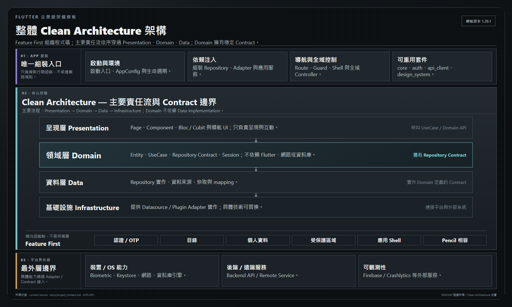
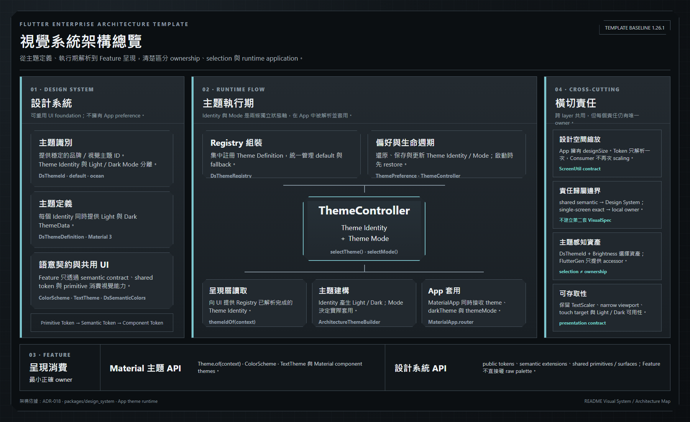

一份可直接作為中大型 Flutter 產品起點的企業級架構模板：Clean Architecture、Feature First、Monorepo、可重用 packages、跨平台基礎能力、文件治理與可驗證的開發流程都已整合在同一個 repository。

**Template Baseline Version：1.26.1**

Android：支援 · iOS：支援 · Web / Windows / macOS / Linux：依賴就緒

> 想直接開始新產品？使用 GitHub 的 **Use this template** 建立獨立 repository，再依 [Template Repository 採用指南](docs/guides/template_repository_adoption.md) 完成一次性的 Template → Product bootstrap。

---

## 為什麼選擇這個模板

這個 repository 的目標不是把所有 Flutter 專案都做成同一種樣子，而是先把最容易在中大型專案失控的邊界固定下來：

- **清楚的 ownership**：App、Feature、Domain、Data、Infrastructure 與 reusable package 有明確責任。
- **可演進的依賴方向**：Presentation → Domain → Data → Infrastructure，避免用跨 Feature Bloc 或全域 service 解決耦合。
- **產品化而不是 Demo 化**：環境、身份、Auth、Storage、Localization、Design System、CI、Observability 等都有正式邊界。
- **可重用但不過度抽象**：只有具穩定 contract 與跨 Feature 重用價值的能力才提升到 `packages/`。
- **模板採用流程完整**：從 GitHub Template Repository 建立產品 repo 後，可保留 provenance 並轉成產品自己的 version / identity / infrastructure authority。
- **長期維護成本可控**：架構決策、文件與驗證流程都有明確入口，不要求每個小改動都跑完整 repository regression。

---

## 架構總覽

模板採 **Feature First + Clean Architecture**。Feature First 負責依產品功能聚合程式碼；當 Feature 存在實際業務與資料行為時，再依 Clean Architecture 維持 Presentation、Domain、Data 與外部實作邊界。App 是唯一 Composition Root，統一組裝 DI、routing、environment、platform adapters 與 application lifecycle。



Feature First 決定程式碼如何依產品功能聚合，Clean Architecture 決定真實業務行為需要哪些責任與邊界；Domain 擁有穩定 contract，Data 提供實作，只有具跨 Feature 重用價值的能力才提升到 `packages/`。更完整的 ownership、runtime boundaries 與平台責任以 [專案現況](docs/project_context.md) 與正式 ADR 為準。

### 視覺系統

內建可重用 Design System、多 Theme Identity、System / Light / Dark Mode、語意化 styling、theme-aware assets 與 responsive design-space scaling。App 負責 runtime theme composition，Feature 只消費穩定的視覺 contract，不把單一畫面的精確樣式重新做成另一套 Design System。



---

## 模板包含內容

| 領域 | 已包含基線 |
|---|---|
| 架構 | Clean Architecture、Feature First、Monorepo、Melos / Dart Pub Workspaces |
| Presentation | `flutter_bloc`、`flutter_hooks`、`hooked_bloc` |
| 導航 | `auto_route`、typed routes、Route Guard、nested navigation |
| Dependency Injection | `get_it` + `injectable`，由 App Composition Root 統一組裝 |
| Models / Codegen | `freezed`、`json_serializable`、`build_runner`、FlutterGen typed asset access |
| 網路 | Dio / Retrofit、Authorization header、refresh token rotation、concurrent 401 single-flight、safe replay |
| 持久化 | FlutterSecureStorage、SharedPreferences、Drift / SQLite、Web dependency-ready Wasm path |
| 認證 | Session restore、secure credential storage、OTP step-up、Android biometric-gated local unlock |
| 視覺 / Design System | Multi-theme Visual System、reusable Design System、Theme Identity × System / Light / Dark Mode、semantic styling、theme-aware representation selection、`flutter_screenutil` design-space scaling、responsive / large-text coverage |
| Localization | English + Traditional Chinese (`zh_TW`)、runtime locale switching、persisted preference |
| Connectivity / Offline | Connectivity state、offline-aware flow、Catalog cache / stale-while-revalidate reference |
| Observability | Production observability foundation 與 provider boundary |
| Delivery / Validation | change-aware validation、risk-based test authoring、self-hosted / GitHub-hosted / manual-local profiles |
| 設計實作 | Repository-local Pencil → Flutter workflow、representation / provenance / fidelity gates |

完整能力與限制請讀 [專案現況](docs/project_context.md)；穩定決策請從 [ADR 索引](docs/adr/README.md) 進入。

---

## 開始建立產品

### 1. 建立自己的 repository

在 GitHub repository 頁面使用 **Use this template**，建立新的產品 repository。一般產品採用不使用 Fork 保存 template parent history。

### 2. 完成一次性的 Template → Product bootstrap

Bootstrap 會把 template repository authority 轉成產品 repository authority，包括：

- repository lifecycle / provenance
- product version semantics
- product name
- CI profile / infrastructure disposition
- Android / iOS identity（若納入本次 scope）

正式流程：

- [Template Repository 採用指南](docs/guides/template_repository_adoption.md)
- [Native Environment 與 Product Identity 採用指南](docs/guides/native_environment_adoption.md)

Bootstrap 只負責「產品 repository 如何出生」，不替產品決定 MVP、Feature、UI/UX 或產品 roadmap。

---

## 快速開始

在 repository root：

```bash
dart pub get
dart run melos run build_runner
dart run melos run analyze
```

基本 Flutter build 驗證：

```bash
cd apps/flutter_architecture
flutter build bundle
```

日常修改不固定要求 full workspace regression；驗證範圍會依實際變更與風險收斂。完整 testing policy 與 operator flow 見 [Testing Governance](docs/guides/testing_governance.md) 與 [CI/CD 操作指南](docs/guides/ci_cd_operations.md)。

---

## 專案結構

```txt
root/
├─ apps/
│  └─ flutter_architecture/   # reference app / Composition Root
├─ packages/
│  ├─ core/                   # shared primitives / failure / storage abstractions
│  ├─ api_client/             # transport / network boundary
│  ├─ auth/                   # reusable auth / session / token behavior
│  └─ design_system/          # reusable visual foundation
├─ docs/                      # current authority / ADR / Guides / active artifacts / retained evidence
├─ repository_identity.json
├─ repository_infrastructure.json
├─ VERSION
└─ README.md
```

更細的責任可以直接從各 module README 進入：

- [Reference App](apps/flutter_architecture/README.md)
- [Core Package](packages/core/README.md)
- [API Client Package](packages/api_client/README.md)
- [Auth Package](packages/auth/README.md)
- [Design System Package](packages/design_system/README.md)

---

## 平台支援

| 平台 | 狀態 | 說明 |
|---|---|---|
| Android | 支援 | Native runtime / storage / security / environment verification 已驗證 |
| iOS | 支援 | Simulator 與 build verification 已驗證；physical-device biometric acceptance / signing / Store distribution 仍為明確 deferred scope |
| Web | 依賴就緒 | Drift Wasm / worker dependency path 已存在；repository 不把 Web runner 視為目前正式支援 target |
| Windows | 依賴就緒 | Architecture / package boundaries 已保持可延伸 |
| macOS | 依賴就緒 | Architecture / package boundaries 已保持可延伸 |
| Linux | 依賴就緒 | Architecture / package boundaries 已保持可延伸 |

平台目前證據與 deferred boundaries 以 [專案現況](docs/project_context.md) 為準。

---

## 文件導覽

Root README 只保留產品與採用入口；完整文件系統請從 **[docs/README.md](docs/README.md)** 進入。

常用入口：

- [專案現況](docs/project_context.md) — current capability、平台與限制快照
- [Architecture Decisions](docs/adr/README.md) — 穩定架構決策與依賴規則
- [Template Repository 採用指南](docs/guides/template_repository_adoption.md) — 從 Template 建立產品 repository
- [Design System Package](packages/design_system/README.md) — 視覺基礎、Theme 與 reusable UI contract
- [Reference App](apps/flutter_architecture/README.md) — Composition Root 與產品整合入口

版本歷史見 [CHANGELOG](CHANGELOG.md)；AI / coding agent 的強制工作規則由 [AGENTS.md](AGENTS.md) 擁有。

---

## 限制與非目標

這份 Template **不是**：

- 所有產品都必須原樣照搬的唯一 Flutter architecture。
- 已完成 App Store / Play Store signing、distribution 與商店發布的成品 App。
- 所有平台都已具有正式 runner 與 runtime acceptance 的 cross-platform starter。
- Device Binding / Passkey / rooted-device defense / server compromise defense 的安全保證。
- 自動替新產品決定 Feature、MVP、UI/UX 或產品 roadmap 的生成器。
- 要求每個小修改都執行 full repository regression 的流程模板。

它提供的是一個已具備清楚 boundary、產品化採用流程、current documentation authority 與可驗證開發機制的 Flutter 起點；實際產品仍應依自己的需求、風險與產品邊界持續演進。
