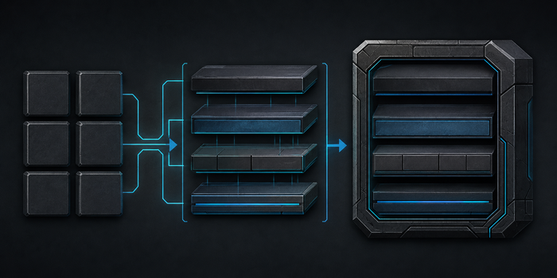
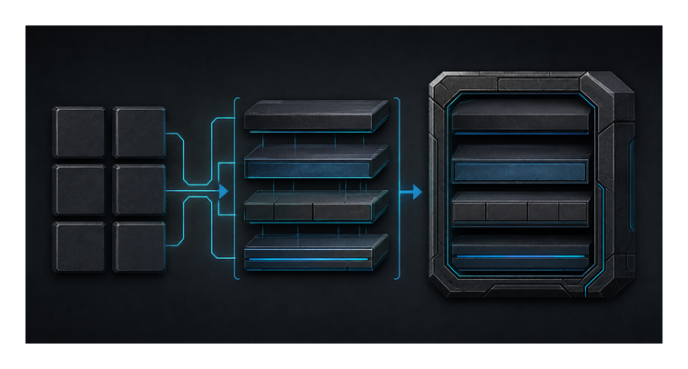
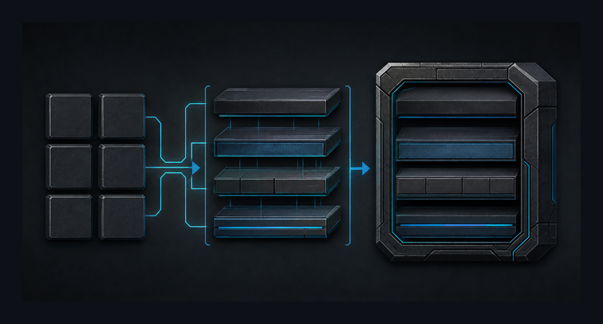
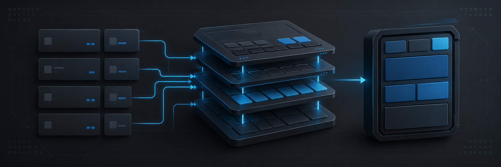
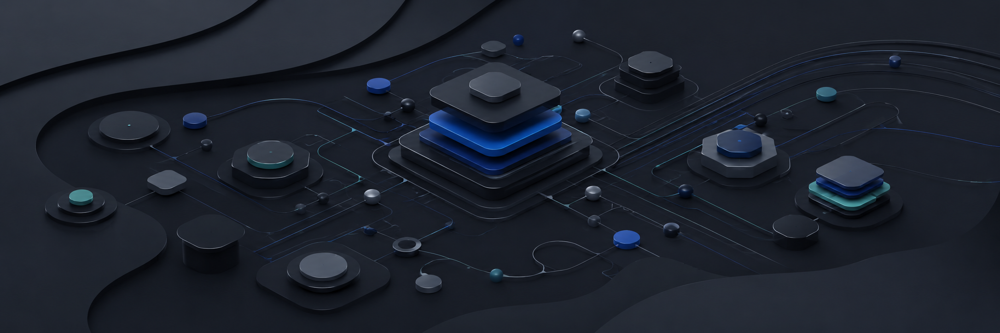

# Task 40-7R-3 — Hero Candidate Visual Review

## Current disposition

```txt
C01: rejected / historical evidence only
C02: rejected / historical evidence only
Current live Hero: none
README Hero consumer: forbidden
Next gate: return to Design decision
```

## Actual visual previews

### C02 — second and final candidate allowed by current Design / Plan


### 700px deterministic downscale



### 360px deterministic downscale


### 700px on GitHub-light-like surrounding canvas



### 700px on GitHub-dark-like surrounding canvas



### Accepted architecture source — Productized topology


### Accepted architecture source — C4 dependency contract


### C01 — first rejected corrective candidate



### Original 40-7 rejected candidate — anti-regression reference



## C01 focused finding

C01 did improve over the original generic dark-tech banner: the image clearly attempted `modules → layers → application` composition. However it failed the accepted contract because small bars／dots／mini controls acted as pseudo-text or UI status glyphs, and the right-side object read as an app-screen／phone-like UI panel. Since the architecture metaphor itself remained visible, C01 was classified as **direction broadly correct, execution defective** and the one allowed replacement C02 was generated.

## C02 13-gate focused review

| Gate | Result | Evidence |
|---|---|---|
| 1. Product recognition | **FAIL** | Main read is industrial hardware／server-rack assembly; it could be infrastructure appliance art rather than this repository. |
| 2. Mobile application foundation signal | **FAIL** | Right-side shell resembles a rugged cabinet/rack, not a mobile application foundation abstraction. |
| 3. Architecture recognition | PASS | Left modules feed ordered middle layers into a final container. |
| 4. Repository-family consistency | **FAIL** | Rectangular structure survives, but heavy bevels、metal texture、rugged enclosure dominate over the accepted diagrams' clean architecture-summary family. |
| 5. Non-duplication | PASS | It is not a direct third C4/UML diagram. |
| 6. First-screen balance | **FAIL** | Generated size is `1774 × 887` (~2:1), materially taller than the accepted ~3:1 low-height Hero band. |
| 7. Actual preview | PASS | Master, source visuals, prior rejected candidates and deterministic previews are all inline in this artifact. |
| 8. Structural family match | **FAIL** | Ordered modules/connectors exist, but hardware enclosure language is now the dominant family signal. |
| 9. Downscale readability | PASS | Main three-part structure remains recognizable at 700px and 360px. |
| 10. Crop safety | PASS | Critical composition remains central and does not depend on edge content. |
| 11. Cross-theme framing | PASS | Self-contained dark canvas remains bounded on both light and dark surrounding canvases. |
| 12. Zero generated text contamination | PASS | C02 removed the pseudo-text／micro-label defect seen in C01. |
| 13. Source-derived, not source-copied | PASS | No source-diagram collage or near-screenshot reproduction is visible. |

Critical result：**FAIL**。任何一個critical FAIL已足以禁止README promotion；C02同時失敗Product recognition、Mobile foundation、Repository-family consistency、First-screen balance與Structural family match。

## Whole-candidate holistic review

Accepted Plan要求回答：若拿掉README標題，這張圖是否仍像本repository的architecture-template metaphor，而不是可替換到其他technology product？

對C02的答案是 **否**。它有「module／layer／assembly」結構，但視覺身份更接近rugged server enclosure／hardware system。把它放到server platform、edge appliance、DevOps infrastructure或cybersecurity產品都合理，因此不能成為Flutter Enterprise Architecture Template的產品Hero。

這不是靠crop、scale、調色或再加prompt修飾能安全通過的局部finding；第二個candidate已觸發accepted Plan的identity-loop stop condition。

## Regeneration budget disposition

```txt
C01 = used
C02 = used
C03 = forbidden
```

依accepted Plan，C02若再次失敗以下任一critical identity gate，就必須返回Design：

- Product recognition；
- Architecture recognition；
- Repository-family consistency / Structural family match；
- Source-derived, not source-copied。

C02已失敗Product recognition與Repository-family consistency／Structural family match，因此**不得生成C03**。

## Review conclusion

```txt
Focused review: FAIL
Whole-candidate holistic review: FAIL
Open P0: 0
P1 disposition: candidate rejected; return to Design
README promotion: forbidden
Current Hero authority: none
Next user-owned gate: Design-direction reconsideration
```

