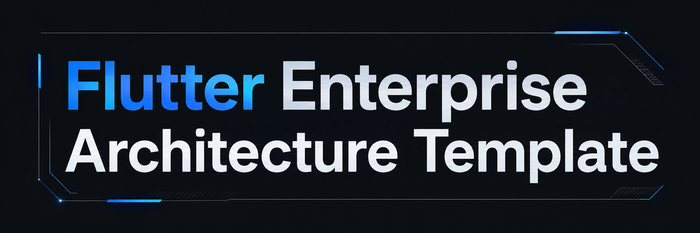
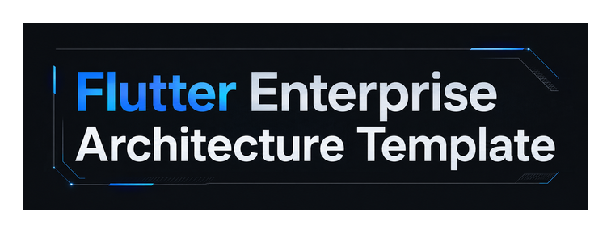
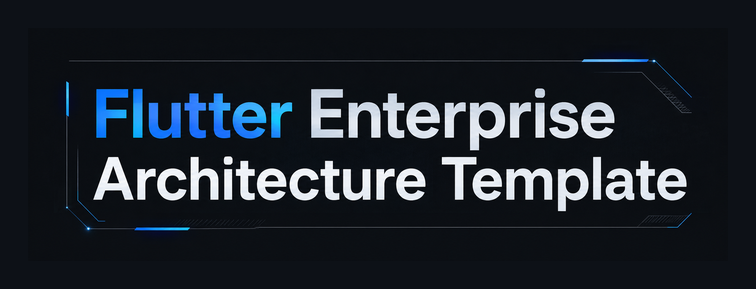

# Milestone 40-7T — README Title Artwork Visual Review

## Candidate identity

```txt
Candidate: C01
State: candidate / non-authoritative / not approved for README
Generation route: chatgpt-web-generation.org.default.generate_chatgpt_web_generation
Master: docs/assets/readme/candidates/flutter-enterprise-architecture-template-title-40-7t-c01.png
Dimensions: 2172 × 724 (~3:1)
SHA-256: d77e79ff9f72638c2bd5527ce391a16f54345845cdcfa057973caadb3d7c5892
README consumer: absent
```

Fresh Executor discovery在本Task確認current integrations只有`chatgpt-web-generation`、`executor`、`pencil`與`pencil-session`；舊`chatgpt-web-image`已不在current integration list。Generation使用fresh discovered `chatgpt-web-generation.org.default.generate_chatgpt_web_generation`，並以native image content回傳給host model。

## Actual candidate preview


## Deterministic downscale evidence

### 700px



### 360px


### GitHub-light-like surrounding background



### GitHub-dark-like surrounding background



Derived evidence只做等比例resize與solid-background padding，不做sharpen、recolor、contrast enhancement、crop或generative edit。

## Focused review

| Gate | Result | Evidence |
|---|---|---|
| Exact title text | **PASS** | Visible text is exactly `Flutter Enterprise Architecture Template`; no missing／extra word observed. |
| Title is dominant | **PASS** | Typography occupies the visual hierarchy; decoration remains secondary. |
| No pseudo-text / extra labels | **PASS** | No secondary copy, fake labels or diagram node text observed. |
| No third architecture diagram | **PASS** | No modules／dependency map／C4-like diagram is present. |
| No generic hardware / phone mockup | **PASS** | No server rack、motherboard、phone UI or cloud illustration. |
| No Flutter-logo imitation | **PASS** | Uses blue accent on the word `Flutter` but does not reproduce the official Flutter mark. |
| Banner ratio / first-screen weight | **PASS** | `2172 × 724` is exactly ~3:1 and remains a low-height title band. |
| 360px readability | **PASS** | Two-line title hierarchy remains legible in deterministic 360px preview. |
| Cross-theme framing | **PASS** | Self-contained dark banner has a complete edge treatment on both light and dark surrounding canvases. |
| Existing README authority preserved | **PASS** | Candidate is not consumed by README; Markdown H1 and both accepted architecture visuals remain untouched pending user acceptance. |

Focused result：**PASS**。

## Whole-candidate holistic review

### Does it solve the actual missing thing?

PASS。與40-7／40-7R不同，這張圖沒有試圖「解釋架構」；它只把repository名稱做成第一視覺。即使完全拿掉兩張architecture diagrams，它也仍清楚是一張title artwork，而不是用途不明的technology illustration。

### Does it compete with the accepted architecture visuals?

PASS。Artwork只負責title / identity，`productized-topology.png`與`c4-dependency-contract.png`仍負責architecture summary與dependency contract，responsibility不重疊。

### Is it over-designed?

PASS。主要視覺元素只有大字、細框線與少量blue/cyan accent；沒有再引入新的symbol system、brand logo或architecture metaphor。

## Current disposition

```txt
Focused review: PASS
Whole-candidate holistic review: PASS
Open P0: 0
Open P1 without disposition: 0
Candidate C01: internally accepted for user visual review
README promotion: BLOCKED until explicit user visual acceptance
```

使用者若Reject，保留具體visual finding並修正／重新生成；不得把目前candidate偷偷接入README。使用者若Accept，才把candidate promotion到live asset path並完成README consumer + focused documentation review。

