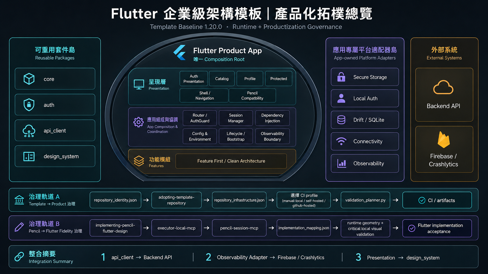
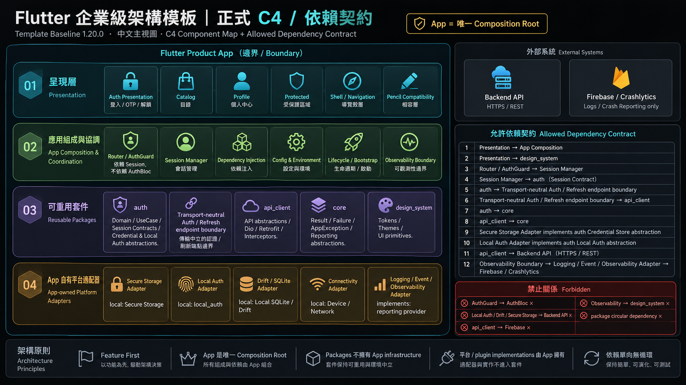

# Project Context

## Purpose and Authority

本文件是 Flutter Enterprise Architecture Template 的 **current-only snapshot**。

它只描述目前仍有效的：

- Template Baseline。
- Repository 定位。
- 架構與責任邊界。
- 已交付能力。
- 平台與安全限制。
- 目前 active work。
- 文件與驗證入口。

它不保存逐 Milestone journal、commit timeline、歷史測試數或過去的「下一步」。歷史規劃、review 與 runtime evidence 應依 `docs/README.md` 的任務式路由按需讀取。

## Current Baseline

```txt
Template Baseline: 1.26.0
Phase 1 / MVP: Completed
Current active milestone: none
Current phase: Asset Runtime & Theme-aware Visual Integration published / formal closure complete；maintenance-ready
Architecture Decision authority: docs/adr/README.md
```

版本字串唯一來源為 `VERSION`；正式版本內容由 `CHANGELOG.md` 記錄。

Milestone completion、release chronology與runtime evidence依`docs/milestones/README.md`、`docs/audits/README.md`、`CHANGELOG.md`與Git history按需讀取；本current snapshot不重複保存。

## Project Purpose

本 repository 是可直接作為中大型 Flutter 專案起點的 Enterprise Architecture Template。

Repository lifecycle machine authority 是 root `repository_identity.json`。目前 template 本體必須維持 `repository_kind = template`；透過 GitHub `Use this template` 建立的新產品 repository才在自己的受治理 bootstrap中完成 `template → product` transition。人類操作入口為 `docs/guides/template_repository_adoption.md`。

核心目標：

- 以可讀、可測試且可延續的方式落實 Clean Architecture。
- 使用 Feature First 組織 App presentation 與 feature-local implementation。
- 使用 Monorepo 管理 App 與具明確 boundary 的 reusable packages。
- 由 App 擔任唯一 Composition Root。
- 以 production source、tests、artifact 與 runtime evidence 驗證架構 claim。
- 讓文件成為可治理的 authoritative system，而不是同步多份歷史副本。

本模板追求清楚邊界與長期維護，不以最少檔案、最少抽象或展示所有可能框架為目標。

## Repository Map

```txt
root/
  apps/
    flutter_architecture/
  packages/
    api_client/
    auth/
    core/
    design_system/
  docs/
  tools/
  AGENTS.md
  repository_identity.json
  README.md
  CHANGELOG.md
  VERSION
```

### App

`apps/flutter_architecture` 是目前唯一 executable Flutter App，負責：

- Bootstrap 與 Dart environment entrypoints。
- App configuration。
- Router、Route Guard 與 authentication navigation orchestration。
- Dependency Injection composition。
- Flutter plugin adapters 與 platform integration。
- Connectivity lifecycle、reconnect signal與App-wide offline presentation。
- SQLite database lifecycle 與 migration。
- Theme、Locale 與 local unlock preference。
- FlutterGen generated asset access、App-owned Theme-aware visual selection 與 runtime asset composition。
- Feature presentation composition。
- Android runner 與 release artifact verification。

### Packages

`packages/core`：

- `Result`、typed `Failure`、`AppException` 等跨 feature 基礎 contract。
- Reporting abstraction 與不吞 unknown error 的錯誤邊界。

`packages/api_client`：

- Dio／Retrofit network boundary；Dio只存在package transport implementation內。
- Auth／Refresh consumer endpoint interfaces、Dio adapters與transport-neutral endpoint failure envelope。
- Auth header、refresh、safe replay 與 request metadata。
- Login、OTP Verify／Resend 等 wire contract。

`packages/auth`：

- Auth Domain、Data、UseCase、Repository 與 Session contract。
- 只依賴transport-neutral Auth／Refresh endpoints，不依賴Dio／Retrofit。
- Credential store abstractions、migration policy、refresh coordination。
- OTP domain state machine。
- Local user presence 與 local unlock policy abstractions。

`packages/design_system`：

- Design tokens、Theme identity、Theme registry 與 Material themes。
- Reusable presentation primitives 與 page-state surfaces。
- 不依賴 App、Feature、Bloc、DI framework 或 persistence implementation。

## Architecture Boundaries

### Architecture Visual Overview

以下兩張圖是目前 `1.23.1` 架構 authority 的**視覺摘要**，用來幫助人類快速理解 ownership、runtime composition、productization governance 與依賴契約；它們不建立新的平行 authority。若圖像摘要與 current snapshot、canonical ADR、root machine manifest 或 production source 衝突，仍以這些既有 authority 為準。

產品化拓樸總覽：



正式 C4-style Component Map 與 Allowed Dependency Contract：



### Clean Architecture and Feature First

主要依賴方向：

```txt
Presentation
  ↓
Domain
  ↓
Data
  ↓
Infrastructure / External Systems
```

App 內以 feature 為主要組織單位；只有真正跨 feature 且具穩定 contract 的能力才提升至 `packages/`。

### Composition Root

App 是唯一 Composition Root：

- Package class 使用 constructor injection 表達依賴。
- Reusable package 不直接依賴 `get_it` 或 `injectable`。
- DI lifecycle、interface binding、plugin adapter 與 environment selection 由 App 決定。

### Presentation and Cross-feature State

- Page 只依賴自身 presentation boundary。
- 不跨 feature 直接讀取其他 feature 的 Bloc。
- 跨 feature authority 透過 SessionManager、Repository Interface、UseCase 或 App coordinator 傳遞。
- Route Guard 不依賴 AuthBloc，只依賴穩定的 Session authority。
- UseCase 以單一業務行為為粒度。
- ADR-032定義Presentation內部responsibility roles與state escalation：Page/View/Section/Component/Surface/Layout不是mandatory folder/class tree；handwritten source以coherent primary responsibility為界，local UI mechanics保留State/Hook/Controller，workflow transition才升Cubit/Bloc。
- Modal UI區分invocation owner與surface implementation owner；custom RenderObject/projection有獨立layout responsibility時不得藏在Page/View orchestration owner。

### Generated Sources

以下 generated files 不可手動修改：

```txt
*.freezed.dart
*.g.dart
*.gr.dart
injection.config.dart
```

需要更新時，修改 source 後執行 build runner。

## Current Technology Map

### Architecture and Workspace

- Clean Architecture。
- Feature First。
- Monorepo。
- Melos 8 + Dart Pub Workspaces。

### Presentation

- `flutter_bloc`。
- `flutter_hooks`。
- `hooked_bloc`。

### Navigation and Composition

- `auto_route`。
- `get_it`。
- `injectable`。

### Models and Generation

- `freezed`。
- `json_serializable`。
- `build_runner`。
- FlutterGen：App package runtime asset 的 generated typed accessor；不擁有 asset semantic ownership、Theme selection 或 provenance。
- Retrofit generation。

### Network

- Dio。
- Retrofit。
- Deterministic Mock API implementations。
- Main Dio 與 Refresh Dio 分離。
- Concurrent 401 single-flight refresh。
- Session-aware safe request replay。

### Persistence and Platform

- Flutter Secure Storage：Auth credential authority。
- Drift／SQLite：AuthUser、Catalog Cache、schema與App database唯一production authority。
- SharedPreferences：Theme、Locale、local unlock preference，以及 legacy credential migration／cleanup。
- sqflite／`sqflite_common_ffi`：只保留historical fixture與rollback test harness。
- `local_auth`：App-owned Android biometric user-presence adapter。

### Design and Localization

- Reusable Design System package。
- Default／Ocean Theme identities。
- Light／Dark／System mode。
- `flutter_screenutil`：App-owned design baseline 初始化與 Design System / bounded feature-component design-space measurement scaling；Typography 不以 `.sp` 作 repository default。
- Flutter official `gen_l10n`。
- English 與繁體中文 `zh_TW`。
- Locale-aware formatting through `intl`。

## Current Capabilities

### Environment and API Composition

- Development、staging、production 使用獨立 Dart entrypoints。
- Development 可選 Mock 或 Real API。
- Staging／production 只允許 Real API。
- Production 強制 HTTPS 並拒絕 placeholder、localhost、loopback 與 invalid URL。
- Mock 與 Retrofit implementation 共用 API abstraction，由 App Composition Root 選擇。

### Authentication and Session

- Login、Logout、Restore Session 與 Session expiration synchronization。
- Access／Refresh Token Pair 與 identity-aware Session generation。
- Refresh token rotation 採 persistence-first。
- 多個同 Session 的並行 401 共用 single-flight refresh。
- 只有符合 Session identity 且可安全重送的 request 才 replay 一次。
- Logout、relogin、account switch 與 stale completion 受 latest-intent／generation contract 保護。

### Credential Persistence and Migration

Current authority：

```txt
Credential Token Pair
  → FlutterSecureStorage

Public AuthUser identity
  → Drift / SQLite

Legacy SharedPreferences credential
  → migration / cleanup only
```

Restore、Login、Refresh、Logout 與 passive invalidation 共用明確 lifecycle contract；credential absence、corruption 與 operational unavailable 不混為同一結果。

### OTP Step-Up Authentication

- Login wire／domain result 明確區分 authenticated 與 OTP challenge。
- OTP pending 時不保存 credential、不建立 Session、不通過 Protected Route。
- Verify 成功是 credential 與 Session commit boundary。
- Resend 會替換 challenge 並使 predecessor 失效。
- Expiration、cooldown、attempts 與 invalid code 使用 typed contract。
- OTP navigation 由 App-owned coordinator 管理。

### Biometric-gated Local Session Unlock

- Biometric 只驗證本機 user presence，不取代 server authentication。
- Local unlock preference 預設 disabled。
- Enabled cold start 必須先通過 biometric-only prompt，之後才可讀取 credential 並 Restore Session。
- Locked 階段 SessionManager 維持 unauthenticated。
- Cancel、not enrolled、unavailable 與 lockout 不允許 fallback 自動 restore。
- Resume 使用五分鐘 grace period 與 single-prompt ordering。
- Android 提供 production settings entry、Native configuration、release artifact 與 runtime smoke evidence。

### Catalog

- Cursor-based pagination。
- Search debounce 與 query generation protection。
- Refresh、Append 與 stale response ordering。
- Feature-level Offline Cache。
- Cache-first + Stale-While-Revalidate initial flow。
- Cursor page storage、chain revision、cycle protection 與 lazy cleanup。
- Public Catalog Cache 不因 Logout 清除。

### Connectivity and Offline State

- App-owned typed connectivity authority統一表達目前網路狀態。
- Provider-neutral adapter contract由App Composition Root選擇實作；目前reference adapter使用`connectivity_plus`。
- Startup與resume會重新檢查connectivity，App-wide offline banner只表達裝置網路狀態。
- Catalog可選擇在reconnect signal後重新驗證資料，但不把connectivity status當成backend reachability保證。
- Backend可達性與request failure仍由operation result與typed Failure表達。

### Design System and Appearance

- Primitive tokens 與 semantic color roles。
- Default／Ocean Light／Dark themes。
- Theme identity 與 Theme mode 分離。
- Pencil/source-driven UI採UI Design Ownership Architecture：shared semantic／Theme Identity／validated reusable component才進Design System；asset provenance、visual-authority metadata、layout mechanics與single-screen exact component values各由獨立owner承擔。
- Generic `*VisualSpec`／`*VisualTokens`／`*UiSpec`／`*StyleConfig`不得同時集中colors、dimensions、typography、assets、gradients、geometry或canonical metadata形成平行Design System。
- Persistent appearance preference。
- Shared blocking page-state surfaces 與 non-blocking status primitives。
- Narrow viewport、large text、theme matrix 與 stable gallery regression。

### Localization

- English／`zh_TW` ARB 與 generated localization。
- System／English／Traditional Chinese preference。
- Runtime locale switching 與 persistence。
- Chinese locale-list resolution。
- Feature-local user-facing Failure mapping。
- Server content 不被錯誤納入 App ARB。

### Exception and Failure Architecture

- Expected operational failure 走 typed `AppException → Failure → Result`。
- Unknown programming／system error 不被轉成一般 Failure 或空 catch 吞掉。
- Cancellation、protocol violation、invariant、cache degradation 與 session lifecycle 有明確分類。
- App 是 reporting Composition Root；packages 不直接依賴 Crashlytics 或 App localization。
- Sensitive credential、OTP code 與 raw payload 不得進 exception、failure、diagnostic、log 或 `toString()`。

### Delivery and Verification

- Repository CI採change-aware execution；documentation-only、workspace與platform gates依changed scope選擇，unknown path、無效Git range或classification failure會fail-safe到完整矩陣。
- CI execution modes為`manual-local`、`self-hosted`與`github-hosted`。
- Manual-local與self-hosted raw evidence由checkout外managed local artifact store擁有，包含run／job manifest、SHA-256、retention、capacity、pin與trash restore contract。
- Self-hosted managed jobs不以`actions/upload-artifact`或`actions/cache`作為主要artifact authority；GitHub-hosted artifact transport只保留人工明確例外。
- Production signing、Store distribution與GitHub repository Branch Protection settings不屬於目前baseline。
- 詳細操作矩陣與operator procedure由`docs/guides/ci_cd_operations.md`擁有。

## Platform Capability

| Platform | Current classification |
|---|---|
| Android | Supported；tracked runner、release artifact 與 runtime smoke evidence |
| iOS | Supported；tracked runner、local Simulator runtime、macOS golden與GitHub-hosted unsigned build evidence |
| Web | Dependency-ready；有Drift Wasm／worker assets，但沒有tracked Web runner；舊experimental storage採explicit reset |
| Windows | Dependency-ready；沒有 tracked runner 與 release runtime evidence |
| macOS | Dependency-ready；沒有 tracked runner 與 release runtime evidence |
| Linux | Dependency-ready；沒有 tracked runner 與 release runtime evidence |

Android與iOS可以被描述為目前Supported platform。iOS Supported claim不包含physical-device acceptance、production signing、IPA、TestFlight或App Store distribution；這些範圍仍有明確deferred disposition。

Current iOS deployment baseline為15.0。

## Security and Support Boundaries

- Secure credential storage 是 credential-at-rest hardening，不防 rooted device、runtime memory extraction 或 server compromise。
- OTP flow 不宣稱防止 SIM-swap、phishing 或保證 SMS provider delivery。
- Biometric unlock 不保存 biometric data，不實作 cryptographic Device Binding。
- Device Binding 與 Passkey 不屬於目前 Template Baseline 1.26.0。
- Repository Android production APK 使用debug verification signing，iOS production `.app`為unsigned verification build；兩者都不可直接作為Store artifact。
- Default base identifier `com.example.flutterarchitecture`、display name與example API domain仍是template placeholder。Adopter必須依`docs/guides/native_environment_adoption.md`從manifest開始同步替換Android、iOS與verification projection。

## Current Work and Maintenance State

```txt
Current active milestone: none
Current phase: Asset Runtime & Theme-aware Visual Integration published / formal closure complete
Maintenance mode: normal development from `dev`; `main` publication-only
```

Active Milestone 的 scope、gate 與 accepted artifacts 由 `docs/roadmap/active.md` 路由。Completed Milestone 的 Design、Plan、review、runtime/release evidence 只由 `docs/milestones/README.md`、`docs/audits/README.md`、`CHANGELOG.md` 與 Git history 按需追溯；本 snapshot 不保存 closure chronology。

## Documentation Routing

Fresh admission 只固定讀：

```txt
AGENTS.md
repository_identity.json
VERSION
```

本文件本身只有在需要 project-wide current capability / support boundary / active-work context 時才讀。其他依任務按需：

- Documentation taxonomy：`docs/README.md`。
- Architecture：`docs/adr/README.md` 與相關 canonical ADR。
- Feature：對應 Feature README、Decision、source 與 tests。
- Package：對應 Package README、Decision、public API、source 與 tests。
- Active Milestone：`docs/roadmap/active.md` + accepted Spec/Plan。
- Review／Runtime Evidence：只有 review/history task 才讀 `docs/audits/` 對應文件。
- Release：`VERSION`、`CHANGELOG.md`、final review 與 Root README landing summary consistency。
- History：`docs/milestones/README.md`、`docs/archive/`、Audits、Plans 與 Git history。

完整 taxonomy 與 metadata policy：

- `docs/README.md`
- `docs/governance/documentation_policy.md`

Validation scope 不由本 snapshot 固定列 command matrix；current machine selection 由 `tools/ci/validation_planner.py` 擁有，operator procedure 依需要讀 `docs/guides/ci_cd_operations.md`。

## Update Rule

本文件只在下列 current facts 改變時更新：

- Template Baseline。
- Supported platform classification。
- Repository purpose 或 architecture map。
- App、Feature、Package responsibility。
- Current capability 或 security claim boundary。
- Active milestone。
- Documentation routing。

不得把逐Task progress、commit hash、歷史測試數、release chronology、runtime evidence counts或完成Milestone的詳細journal追加回本文件。
